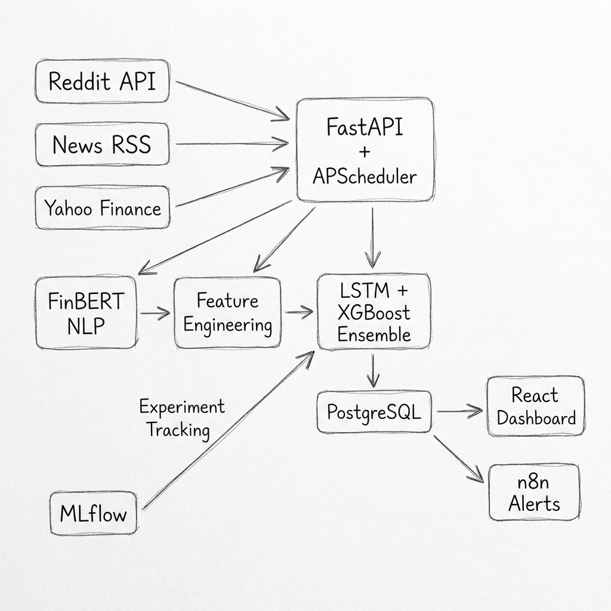

<div align="center">

# Stock Price Predictor

### Multi-Source Sentiment + Ensemble ML for Hourly Stock Direction Prediction

An end-to-end ML pipeline that scrapes financial sentiment from Reddit and news feeds, scores it using **FinBERT** (finance-tuned BERT), engineers 50+ technical and sentiment features, and predicts stock movements using an **LSTM + XGBoost ensemble** — backed by PostgreSQL, scheduled hourly with APScheduler, tracked with MLflow, served via FastAPI, and visualized on a React dashboard.

[](https://www.python.org/downloads/)
[](https://opensource.org/licenses/MIT)
[](https://www.postgresql.org/)
[](https://fastapi.tiangolo.com/)
[](https://react.dev/)

</div>

---

## Motivation

Most stock prediction projects treat it as a single-model, single-signal problem. Markets are driven by quantitative signals, crowd psychology, and information flow simultaneously. This project fuses all three:

1. **Multi-source signals** — Reddit sentiment (crowd psychology), financial news (information flow), and technical indicators (price patterns)
2. **Finance-specific NLP** — FinBERT understands financial context like "short squeeze" (positive for holders) and "beat expectations" (positive despite "declined")
3. **Ensemble heterogeneity** — LSTM captures temporal dynamics while XGBoost excels at feature interactions; combining them yields better generalization
4. **Hourly scheduling** — Predictions run every hour via APScheduler cron jobs, stored in PostgreSQL, with n8n polling for automated alerts

---

## Architecture



**Data flow:**
1. APScheduler triggers hourly on weekdays
2. Backend scrapes Reddit, News RSS, and Yahoo Finance
3. FinBERT scores sentiment on financial text
4. LSTM + XGBoost ensemble predicts direction + confidence
5. Results saved to PostgreSQL
6. FastAPI serves results to the React dashboard
7. n8n polls the database and sends Email/Slack alerts

---

## Features

| Category | Feature | Details |
|----------|---------|---------|
| Data | Multi-source ingestion | Reddit (PRAW), Financial News (RSS), Market Data (yfinance) |
| Data | Ticker-aligned merging | Aggregates text by ticker x hour with `[SEP]` tokenization |
| NLP | FinBERT sentiment | Finance-tuned BERT (`ProsusAI/finbert`) with GPU acceleration |
| NLP | Weighted aggregation | Length-weighted multi-text sentiment scoring |
| Features | 8 technical indicators | RSI, MACD, Bollinger Bands, SMA, EMA, ATR, OBV, VWAP |
| Features | Derived signals | Crossover detection, overbought/oversold, price-to-MA ratios |
| Features | Lag features | Price lags, sentiment lags, rolling mean/std, momentum, gap |
| ML | LSTM (PyTorch) | Multi-layer with dropout, AdamW, LR scheduling, early stopping |
| ML | XGBoost | Histogram-based gradient boosting with feature importance |
| ML | Ensemble | Weighted averaging, stacking (Ridge meta-learner), blending |
| Database | PostgreSQL 16 | Predictions, sentiment entries, trade logs, backtest results |
| Scheduling | APScheduler | Hourly cron jobs (weekdays), configurable timezone |
| Automation | n8n | Webhook polling, Email/Slack alerts on prediction events |
| MLOps | MLflow | Parameters, metrics, artifacts, model registry |
| Serving | FastAPI | 12 REST endpoints with CORS + PostgreSQL backend |
| Frontend | React + Vite | 4-page dashboard: Overview, Predictions, Sentiment, Backtest |
| Validation | Backtesting | Sharpe ratio, max drawdown, alpha vs benchmark, win rate |
| DevOps | Docker + CI/CD | Multi-service compose, GitHub Actions, matrix testing |

---

## Quick Start

### Prerequisites

- Python 3.10+
- PostgreSQL 16 (or use Docker)
- Node.js 18+ (for frontend)

### Docker (recommended)

```bash
git clone https://github.com/charan2456/stock_price_predictor.git
cd stock_price_predictor

cp .env.example .env
# Edit .env with your Reddit API credentials + database URL

make docker-up

# Services:
#   API:        http://localhost:8000
#   Frontend:   http://localhost:3000
#   MLflow:     http://localhost:5000
#   PostgreSQL: localhost:5432
```

### Manual Setup

```bash
pip install -e ".[dev]"

# Start PostgreSQL
docker run -d --name stock-pg \
  -e POSTGRES_DB=market_sentinel \
  -e POSTGRES_USER=sentinel \
  -e POSTGRES_PASSWORD=sentinel \
  -p 5432:5432 \
  postgres:16-alpine

cp .env.example .env

make scrape     # Collect data from Reddit + News + Yahoo Finance
make train      # Train ensemble model with MLflow tracking
make serve      # Start FastAPI server

cd frontend && npm install && npm run dev   # http://localhost:5180
```

---

## Project Structure

```
stock_price_predictor/
|
|-- src/
|   |-- data/
|   |   |-- reddit_scraper.py          # PRAW multi-subreddit scraper
|   |   |-- news_scraper.py            # RSS feed aggregator
|   |   |-- market_data.py             # yfinance OHLCV fetcher
|   |   +-- data_pipeline.py           # Pipeline orchestrator
|   |
|   |-- features/
|   |   |-- sentiment.py               # FinBERT sentiment analyzer
|   |   |-- technical_indicators.py    # RSI, MACD, BB, SMA, EMA, ATR, OBV, VWAP
|   |   +-- feature_engineering.py     # Full feature pipeline
|   |
|   |-- models/
|   |   |-- lstm_model.py              # PyTorch LSTM with early stopping
|   |   |-- xgboost_model.py           # XGBoost with feature importance
|   |   |-- ensemble.py                # Weighted/Stacking/Blending ensemble
|   |   +-- trainer.py                 # MLflow-instrumented training
|   |
|   |-- database/
|   |   |-- models.py                  # SQLAlchemy ORM models
|   |   +-- db.py                      # Engine, session factory, init
|   |
|   |-- serving/
|   |   +-- app.py                     # FastAPI server (12 endpoints)
|   |
|   |-- scheduling/
|   |   +-- scheduler.py               # APScheduler configuration
|   |
|   |-- backtesting/
|   |   +-- backtester.py              # Sharpe, drawdown, alpha computation
|   |
|   +-- utils/
|       |-- config.py                  # YAML config with env-var overrides
|       +-- logger.py                  # Structured logging (loguru)
|
|-- frontend/                          # React + Vite dashboard
|-- configs/default.yaml               # All hyperparameters + DB config
|-- tests/test_core.py                 # Config, indicators, backtester tests
|-- docker/                            # Dockerfile + docker-compose.yml
|-- Makefile                           # One-command operations
|-- pyproject.toml                     # Python packaging
+-- .env.example                       # Required environment variables
```

---

## FinBERT vs VADER

| Text | VADER | FinBERT | Winner |
|------|-------|---------|--------|
| "Stock surged on strong earnings guidance" | +0.42 | **+0.91** | FinBERT |
| "The short squeeze is getting out of hand" | -0.31 | **+0.15** | FinBERT |
| "Revenue declined but beat expectations" | -0.44 | **+0.62** | FinBERT |
| "Bearish divergence on the daily chart" | -0.24 | **-0.78** | FinBERT |

FinBERT understands financial context — "short squeeze" is positive for holders, "beat expectations" is positive despite "declined", and "bearish divergence" carries stronger negative signal than generic tools detect.

---

## Ensemble: LSTM + XGBoost

**Why two models?**

- **LSTM** handles sequential patterns, temporal dependencies, and momentum/regime detection
- **XGBoost** handles feature interactions, heterogeneous inputs, and missing values

**Combination methods:**
- Weighted averaging (default: LSTM 0.4, XGBoost 0.6)
- Stacking with Ridge meta-learner
- Blending

---

## API Reference

Start the server with `make serve`, then visit `http://localhost:8000/docs` for interactive docs.

| Endpoint | Method | Description |
|----------|--------|-------------|
| `/health` | GET | Server health + model status |
| `/predictions/latest` | GET | Most recent hourly prediction run |
| `/predictions/history?limit=24` | GET | Last N prediction runs |
| `/predictions/ticker/{ticker}?limit=24` | GET | Per-ticker prediction history |
| `/predictions/run-now` | POST | Manually trigger a prediction run |
| `/sentiment/feed?limit=20` | GET | Recent sentiment entries |
| `/sentiment/ticker/{ticker}?limit=24` | GET | Per-ticker sentiment history |
| `/backtest/results` | GET | Latest backtest metrics |
| `/backtest/trades?limit=50` | GET | Recent trade log with P&L |
| `/scheduler/status` | GET | Scheduler status + next run time |

---

## MLflow Tracking

Every training run logs:

| What | Example |
|------|---------|
| Parameters | `lstm_hidden_size=128`, `xgb_n_estimators=500`, `ensemble_method=weighted` |
| Metrics | `rmse=0.0234`, `mae=0.0189`, `r2=0.42`, `directional_accuracy=0.58` |
| Artifacts | Model weights, feature importance CSV, scaler objects |

```bash
make mlflow-ui    # http://localhost:5000
```

---

## Configuration

All hyperparameters live in `configs/default.yaml`:

```yaml
data:
  tickers: ["AAPL", "MSFT", "GOOGL", "AMZN", "TSLA"]
  reddit:
    subreddits: ["stocks", "wallstreetbets", "investing"]

training:
  lstm:
    hidden_size: 128
    num_layers: 2
    sequence_length: 30
  xgboost:
    n_estimators: 500
    max_depth: 8
  ensemble:
    method: weighted
    weights: { lstm: 0.4, xgboost: 0.6 }

scheduling:
  enabled: true
  cron_hour: "*"
  cron_minute: 0
  cron_day_of_week: "mon-fri"
  timezone: "Asia/Kolkata"
```

Override via environment variables: `DATABASE_URL=postgresql://...`

---

## n8n Alerting

1. n8n polls `GET /predictions/latest` every hour
2. Filters for confidence > 80% or sentiment shift > 0.3
3. Sends Email/Slack notification with prediction details

---

## Testing

```bash
make test          # Full test suite with coverage
make lint          # Ruff linting
make typecheck     # mypy type checking
make quality       # All checks (lint + typecheck + test)
```

---

## License

MIT License — see [LICENSE](LICENSE) for details.

---

<div align="center">

**Built by [Charan Kotapati](https://github.com/charan2456)**

</div>
